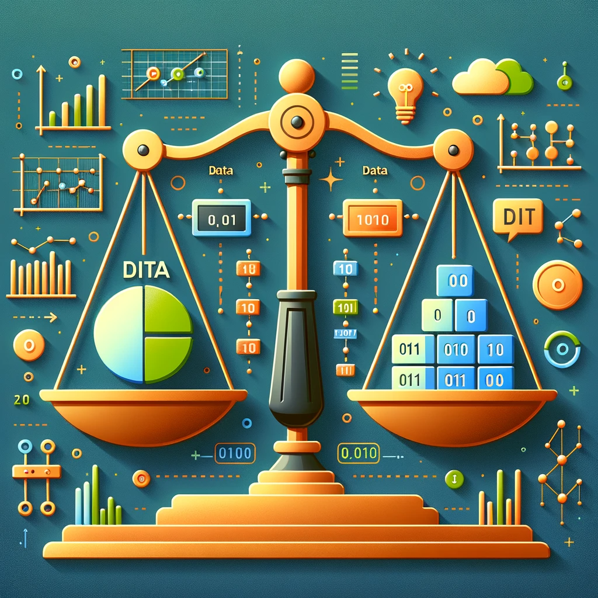

   <h1> Awesome Imbalanced Learning in Production</h1>

  

  

If you find this content insightful, feel free to support with a ⭐

This is a curated list of resources showcasing how different companies have tackled the challenge of imbalanced data in production environments. It's a valuable resource for professionals dealing with similar issues in machine learning and data science.

Inspired By [Awesome-System-Design](https://GitHub.com/madd86/awesome-system-design)

Started By [Kumar Abhishek]

## Contents

[Case Studies](#case-studies)

[Articles](#articles)

[Videos](#videos)

[Tools and Frameworks](#tools-and-frameworks)

[Datasets](#datasets)

[GitHub repos] (#gitHub-repos)

[Awesome libraries on Github](#awesome-libraries-on-Github)

[Books](#books)

### Case Studies

- [Source: ML system design: 300 case studies to learn from](https://www.evidentlyai.com/ml-system-design)
  
| Company   | Title                                                                                                            | Tag                               | Year |
|-----------|------------------------------------------------------------------------------------------------------------------|-----------------------------------|------|
| Stripe    | [How we built it: Stripe Radar](https://stripe.com/blog/how-we-built-it-stripe-radar)                             | fraud detection                   | 2023 |
| Pinterest | [An ML based approach to proactive advertiser churn prevention](https://medium.com/pinterest-engineering/an-ml-based-approach-to-proactive-advertiser-churn-prevention-3a7c0c335016) | churn prediction                  | 2023 |
| Wayfair   | [Introducing Melange: A Customer Journey Embedding System for Improving Fraud and Policy Abuse Detection](https://www.aboutwayfair.com/careers/tech-blog/introducing-melange-a-customer-journey-embedding-system-for-improving-fraud-and-scam-detection) | fraud detection                   | 2023 |
| Uber      | [Risk Entity Watch – Using Anomaly Detection to Fight Fraud](https://www.uber.com/en-IN/blog/risk-entity-watch/?uclick_id=9c4355d3-795f-4b1d-b18e-4b8b4c8ed29f) | fraud detection                   | 2023 |
| BlaBlaCar | [How we used machine learning to fight fraud at BlaBlaCar — Part 1](https://medium.com/blablacar/how-we-used-machine-learning-to-fight-fraud-at-blablacar-part-1-3b976c9dcdf6) | fraud detection                   | 2023 |
| Zillow    | [SpectroBrain: Detecting Phone Spam with Semi-Supervised Learning](https://www.zillow.com/tech/spectrobrain-detecting-phone-spam-with-semi-supervised-learning/) | spam / content moderation         | 2023 |
| Grab      | [LLM-powered data classification for data entities at scale](https://engineering.grab.com/llm-powered-data-classification) | generative AI                     | 2023 |
| BlaBlaCar | [How we built our machine learning pipeline to fight fraud at BlaBlaCar — Part 2](https://medium.com/blablacar/how-we-built-our-machine-learning-pipeline-to-fight-fraud-at-blablacar-part-2-476335f459b4) | fraud detection                   | 2023 |
| Grab      | [Unsupervised graph anomaly detection - Catching new fraudulent behaviours](https://engineering.grab.com/graph-anomaly-model) | fraud detection                   | 2023 |
| Linkedin  | [Viral spam content detection at LinkedIn](https://engineering.linkedin.com/blog/2023/viral-spam-content-detection-at-linkedin) | spam / content moderation         | 2023 |
| Spotify   | [How We Automated Content Marketing to Acquire Users at Scale](https://engineering.atspotify.com/2023/11/how-we-automated-content-marketing-to-acquire-users-at-scale/) | ad ranking / targeting,content personalization | 2023 |
| Wayfair   | [Hamlet: Wayfair's ML Approach to Identifying Business Shopper](https://www.aboutwayfair.com/careers/tech-blog/hamlet) | lead scoring                      | 2023 |

### Articles

- [Exploring Imbalanced Data Solutions](https://link-to-article)
- [Practical Guide to Handle Imbalanced Datasets](https://link-to-article)

### Videos

| Video Title | Company | Year |
|---|---|---|
| [Natalie Hockham: Machine learning with imbalanced data sets](https://www.youtube.com/watch?v=X9MZtvvQDR4) | GoCardless | 2015 |
| [PyData Tel Aviv Meetup: GANs for Imbalanced Classification Problems - Moshe Salhov](https://www.youtube.com/watch?v=jy4DVV5bFWc) | Playtika | 2018 |
| [Brendan Herger - Machine Learning Techniques for Class Imbalances & Adversaries](http://www.youtube.com/watch?v=u72FD79tsxA) | CapitalOne | 2016 |

### Libraries, Tools and Frameworks

- [imbalanced-learn](https://github.com/scikit-learn-contrib/imbalanced-learn)
- [SMOTE-variants for imbalanced learning](https://github.com/analyticalmindsltd/smote_variants)
- [imbalanced-DL: Deep Imbalanced Learning in Python](https://github.com/ntucllab/imbalanced-DL)
- [IMBENS: Class-imbalanced Ensemble Learning in Python](https://github.com/ZhiningLiu1998/imbalanced-ensemble)
- [MESA: Meta-sampler for imbalanced learning](https://github.com/ZhiningLiu1998/mesa)

### Datasets

- [Imbalanced Dataset Repositories](https://link-to-dataset)

### awesome-libraries on Github

- https://github.com/Stomach-ache/awesome-long-tail-learning
- https://github.com/ZhiningLiu1998/awesome-imbalanced-learning/
- https://github.com/CoinCheung/pytorch-loss
- https://github.com/ZhugeKongan/torch-template-for-deep-learning
- https://github.com/hh-xiaohu/Image-augementation-pytorch
- https://github.com/GZWQ/Awesome-Long-Tailed
- https://github.com/danielgy/Paper-list-on-Imbalanced-Time-series-Classification-with-Deep-Learning

### Books
- [Imbalanced Classification with Python: Better Metrics, Balance Skewed Classes, Cost-Sensitive Learning by by Jason Brownlee](https://www.amazon.com/Imbalanced-Classification-Python-Cost-Sensitive-Learning/dp/B09FP165TZ/)
- [Learning from Imbalanced Data by Alberto Fernández, Salvador García, Mikel Galar, et al. ](https://www.amazon.com/Learning-Imbalanced-Data-Alberto-Fern%C3%A1ndez-ebook/dp/B07FM9PLWN/)
- [Imbalanced Learning: Foundations, Algorithms, and Applications](https://www.amazon.com/Imbalanced-Learning-Foundations-Algorithms-Applications-ebook/dp/B00DAB28YM)
- [Machine Learning for Imbalanced Data: Tackle imbalanced datasets using machine learning and deep learning techniques](https://www.amazon.com/Machine-Learning-Imbalanced-Data-imbalanced/dp/1801070830/)

---

Remember, this is a living document and will be updated with more resources over time. Contributions are welcome!
